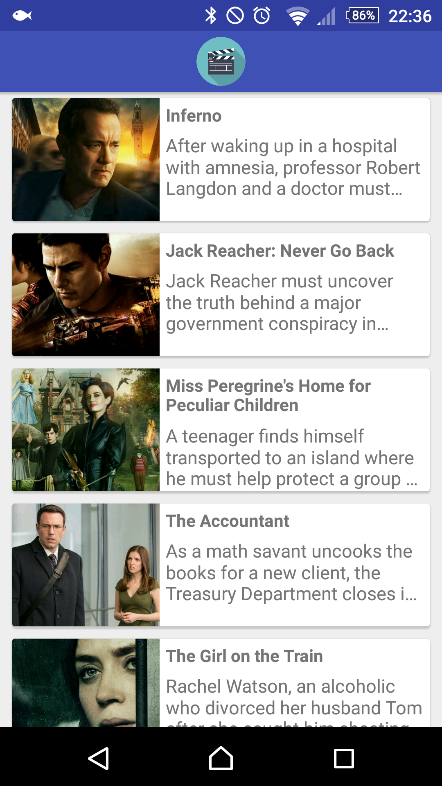

# Upcoming Movies

Android project that fetches a list of upcoming movies from The Movie Database API,
using a lot of different animations, to showcase some possibilities in Android.

Some really specific fixes were applied to make Glide work with Shared Elements Transition,
so this projects is a good reference on how it can be done.

Works only on Android Lollipop or newer.

Uses The Movie DB API
